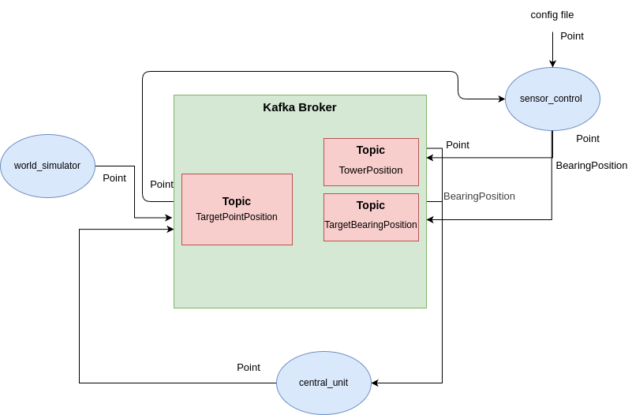

# Target Location Estimation Kafka Project

This project is a Kafka implementation project.
Three separate applications communicate via Kafka and perform various mathematical calculations and try to find a virtual target with the calculations they make.

What problem is solved?\
– Estimate the geographic location of a target from multiple bearing-only sensors in real-time.

Scenario\
– A synthetic “world simulator” generates ground-truth & sensor bearings; those bearings travel through Kafka topics; a “central unit” fuses them; a “sensor-control” service configures the sensors.
<p align="center">

<br>
<em>Kafka Messaging Diagram</em>
</p>


## Table of Contents

- [Project Structure](#Project-Structure)
- [How To Use](#how-to-use)
   - [Installation](#installation)
   - [Features](#features)
   - [Config Files](#config-files)
   - [Running The Application](#running-the-application)
- [Technology](#technology)
   - [Java](#java)
   - [Kafka](#kafka)
   - [Spring Boot](#spring-boot)
- [References](#references)


## Project Structure

The project has the following directory structure:

```
.
├── base-domain
│   ├── build.gradle.kts
│   ├── gradle
│   │   └── wrapper
│   │       ├── gradle-wrapper.jar
│   │       └── gradle-wrapper.properties
│   ├── gradlew
│   ├── gradlew.bat
│   └── src
│       ├── main
│       │   ├── java
│       │   │   └── com
│       │   │       └── example
│       │   │           └── basedomain
│       │   │               ├── BaseDomainApplication.java
│       │   │               ├── config
│       │   │               │   ├── Publisher.java
│       │   │               │   └── TopicConfig.java
│       │   │               └── dto
│       │   │                   ├── BearingPosition.java
│       │   │                   └── Point.java
│       │   └── resources
│       │       └── application.properties
│       └── test
│           └── java
│               └── com
│                   └── example
│                       └── basedomain
│                           └── BaseDomainApplicationTests.java
├── build.gradle.kts
├── central-unit
│   ├── build.gradle.kts
│   ├── gradle
│   │   └── wrapper
│   │       ├── gradle-wrapper.jar
│   │       └── gradle-wrapper.properties
│   ├── gradlew
│   ├── gradlew.bat
│   └── src
│       ├── main
│       │   ├── java
│       │   │   └── com
│       │   │       └── example
│       │   │           └── centralunit
│       │   │               ├── CentralUnitApplication.java
│       │   │               ├── config
│       │   │               │   └── TargetPositionTopicConfig.java
│       │   │               ├── consumer
│       │   │               │   └── KafkaConsumer.java
│       │   │               ├── data
│       │   │               │   └── CentralUnit.java
│       │   │               ├── producer
│       │   │               │   └── TargetPositionPublisher.java
│       │   │               └── service
│       │   │                   ├── CentralUnitService.java
│       │   │                   └── CentralUnitServiceRunner.java
│       │   └── resources
│       │       └── application.properties
│       └── test
│           └── java
│               └── com
│                   └── example
│                       └── centralunit
│                           └── CentralUnitApplicationTests.java
├── gradle
│   └── wrapper
│       ├── gradle-wrapper.jar
│       └── gradle-wrapper.properties
├── gradlew
├── gradlew.bat
├── sensor-control
│   ├── build.gradle.kts
│   ├── gradle
│   │   └── wrapper
│   │       ├── gradle-wrapper.jar
│   │       └── gradle-wrapper.properties
│   ├── gradlew
│   ├── gradlew.bat
│   └── src
│       ├── main
│       │   ├── java
│       │   │   └── com
│       │   │       └── example
│       │   │           └── sensorcontrol
│       │   │               ├── calculation
│       │   │               │   └── CalculateBearing.java
│       │   │               ├── config
│       │   │               │   ├── TargetBearingPositionTopicConfig.java
│       │   │               │   └── TowerPositionTopicConfig.java
│       │   │               ├── data
│       │   │               │   └── SensorTower.java
│       │   │               ├── kafka
│       │   │               │   └── PositionConsumer.java
│       │   │               ├── producer
│       │   │               │   ├── TargetBearingPositionPublisher.java
│       │   │               │   └── TowerPositionPublisher.java
│       │   │               └── SensorControlApplication.java
│       │   └── resources
│       │       └── application.properties
│       └── test
│           └── java
│               └── com
│                   └── example
│                       └── sensorcontrol
│                           └── SensorControlApplicationTests.java
├── settings.gradle.kts
├── src
│   ├── main
│   │   ├── java
│   │   │   └── com
│   │   │       └── example
│   │   │           └── target_location_estimation
│   │   │               └── TargetLocationEstimationApplication.java
│   │   └── resources
│   │       └── application.properties
│   └── test
│       └── java
│           └── com
│               └── example
│                   └── target_location_estimation
│                       └── TargetLocationEstimationApplicationTests.java
└── world-simulator
    ├── build.gradle.kts
    ├── gradle
    │   └── wrapper
    │       ├── gradle-wrapper.jar
    │       └── gradle-wrapper.properties
    ├── gradlew
    ├── gradlew.bat
    └── src
        ├── main
        │   ├── java
        │   │   └── com
        │   │       └── example
        │   │           └── worldsimulator
        │   │               ├── config
        │   │               │   └── TargetTopicConfig.java
        │   │               ├── data
        │   │               │   └── Target.java
        │   │               ├── service
        │   │               │   └── TargetPositionPublisher.java
        │   │               ├── simulator
        │   │               │   ├── TargetSimulator.java
        │   │               │   └── TargetSimulatorRunner.java
        │   │               └── WorldSimulatorApplication.java
        │   └── resources
        │       └── application.properties
        └── test
            └── java
                └── com
                    └── example
                        └── worldsimulator
                            └── WorldSimulatorApplicationTests.java
                            
```

## How to use

### INSTALLATION
Check if java sdk is installed on your computer. Open a terminal and type this command

```bash
java --version
```

If you do not have Java installed on your computer, install it using the link below. Java 19+ is recommended.
- [JAVA INSTALLATION GUIDE](https://www.java.com/en/download/help/download_options.html)

If you do not have git installed on your computer, install it using the link below.
- [GIT INSTALLATION GUIDE](https://git-scm.com/book/en/v2/Getting-Started-Installing-Git)


If you do not have Kafka installed on your computer, install it using the link below. This project used Kafka 4.0
- [KAFKA INSTALLATION GUIDE](https://kafka.apache.org/quickstart)

Create new package working directory and clone the repository

```bash
cd && mkdir workplace && cd workplace
git clone https://github.com/AhmetNeoSari/target_location_estimation.git
cd target_location_estimation
```

---

### Features

| Module | Purpose | Principal Topics |
| ------ | ------- | ---------------- |
| **world-simulator** | Generates a moving target’s 2‑D path(x, y) and publishing through kafka (ground truth) | publishes `TargetPointPosition` |
| **sensor-control** | Accepts tower coordinates from application.properties, Consumes TargetPointPosition and generating bearing | publishes `TowerPosition`,`TargetBearingPosition` consumes `TargetPointPosition` |
| **central-unit** | Estimates the target coordinates using sensor coordinates and sensor bearings. | consumes `TargetBearingPosition`, `TowerPosition` publishes `TargetPointPosition` |
| **base-domain** | Plain DTOs & shared topic builders | *n/a* |

---


### Config Files

There are 4 separate modules in the project root directory: base-domain, central-unit, sensor-control, world-simulator. The other three applications depend on base-domain. 
Each module has an application.properties file in the src/main/resources directory.
For example, you can view the one in the base-domain module with the following command:
```bash
cd base-domain/src/main/resources
cat application.properties
```
These application.properties files contain port addresses, producer-consumer names, and similar properties. You can customize it according to your own use.


### Running The Application
First, we need to compile the project. To do this, you must first view the build.gradle.kts in each module and update it according to your own java version. Java 21 is used by default.

<p align="center">

<br>
<em>Java version check</em>
</p>


Start the Kafka server. Go to the directory where you downloaded Kafka and run it with the following command
```bash
bin/kafka-server-start.sh config/server.properties
```

To listen to Kafka topics, open 3 separate terminals and enter the following commands. Make sure that the topic names match the application.properties
```bash
bin/kafka-console-consumer.sh \
--bootstrap-server localhost:9092 \
--topic TargetPointPosition

bin/kafka-console-consumer.sh  \
--bootstrap-server localhost:9092 \ 
--topic TowerPosition

bin/kafka-console-consumer.sh  \
--bootstrap-server localhost:9092 \
--topic TargetBearingPosition
```

Make the gradlew file in the root directory executable.
```bash
cd ~/workplace/target_location_estimation
chmod +x ./gradlew
```

Build the project
```bash
./gradlew build
```

Once the build process is complete, open four separate terminals. Then run the application by entering the following three commands.


```bash
cd central-unit
java -jar build/libs/central-unit-0.0.1-SNAPSHOT.jar
```
```bash
cd sensor-control
java -jar build/libs/sensor-control-0.0.1-SNAPSHOT.jar
```
```bash
cd world-simulator
java -jar build/libs/world-simulator-0.0.1-SNAPSHOT.jar
```

The applications will start working.


## Technology

### Java

Records and pattern matching strip away boiler‑plate; virtual threads let us handle thousands of Kafka messages in plain blocking code without exhausting OS threads.

Every micro‑service is compiled and run on JDK 21. DTOs such as Point and BearingPosition are Java records, and the consumers run on virtual‑thread executors.

### Kafka

Kafka is a distributed, log‑based streaming platform that powers publish/subscribe messaging and durable event storage.

Kafka decouples services via asynchronous events, keeps an immutable history we can replay, and scales horizontally. Version 4 defaults to KRaft, so no external ZooKeeper is required.


world‑simulator publishes target's coordianate via TargetPointPosition topic (ground truth).

sensor‑control consumes Target's coordinates via TargetPointPosition topic, converts them into bearings, distances information, and republishes via TargetBearingPosition topic. It also publishes sensor coordinates via the TowerPosition topic.

The central-unit consumes the bearing and sensor-coordinates coming from the sensors via the Target Bearing Position and Tower Position topics. It uses this information to estimate the target coordinate. It publishes this information via the TargetPointPosition topic.


### Spring Boot

Spring Boot 3.4.5

Spring Boot is An opinionated framework that auto‑configures Java apps, bundling an embedded web server and a rich ecosystem of starters.

Each module has its own @SpringBootApplication entry point. Kafka templates and listeners are declared with a handful of annotations; During local dev spring‑boot‑devtools hot‑reloads code, and ./gradlew nativeCompile builds tiny GraalVM binaries for ultra‑fast startup.

## References
https://stackoverflow.com/questions/51494644/how-do-you-convert-a-bearing-in-degrees-to-a-gradient-slope-using-r

https://www.baeldung.com/java-intersection-of-two-lines

https://kafka.apache.org/quickstart

https://www.geeksforgeeks.org/bigdecimal-class-java/
